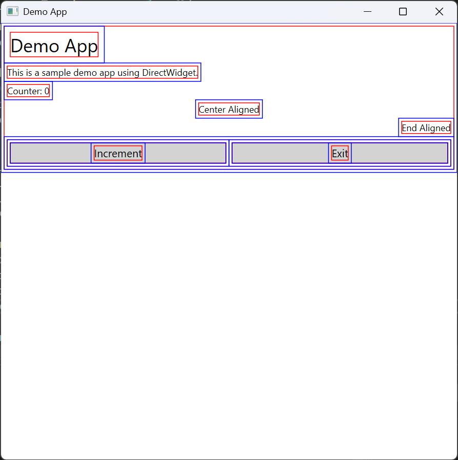
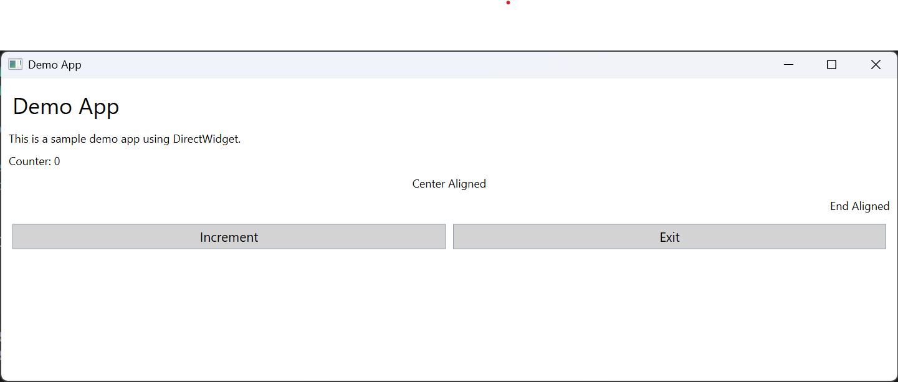

# DirectWidget

A simple UI framework based on Direct2D for Windows.

### Layouts

* StackLayout

### Widgets

* BoxWidget
* TextWidget
* ButtonWidget

## Screenshots

## Features

* [x] Text rendering
* [x] Click callback
* [x] Layout and widget alignment
* [x] Mutable widget properties
* [x] Application log and error handler
* [ ] Dependency property
* [ ] Render invalidation on property change
* [ ] Layout invalidation on property change
* [ ] Text field
* [ ] Checkbox
* [ ] Scroll viewer
